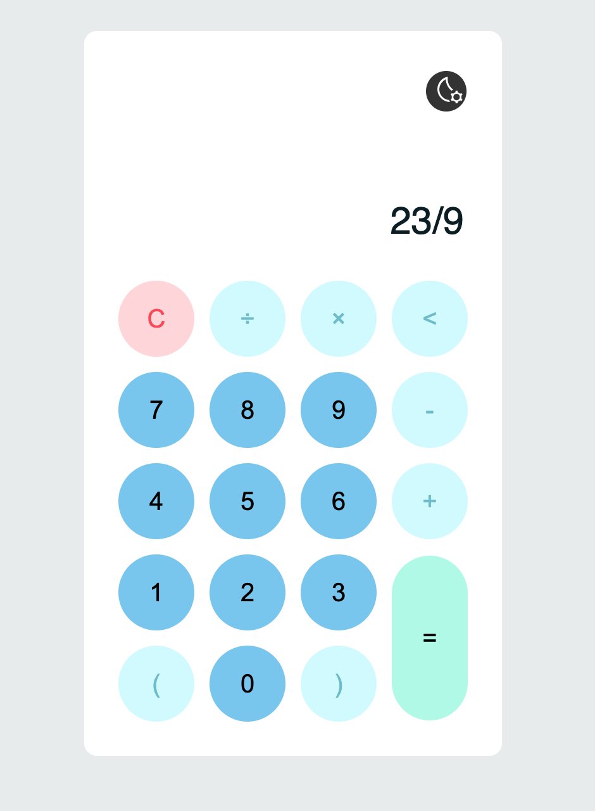

# Calculator
Simple calculator made with HTML, CSS AND JS. Created with a mobile format and with the possibility of switching between themes (dark - light).

# Tecnologies
- HTML
- CSS
- JavaScript

# UI Design (Wireframes)
## Calculator Dark

## Calculator Ligth

### How to start project

Open with Live Server index.html