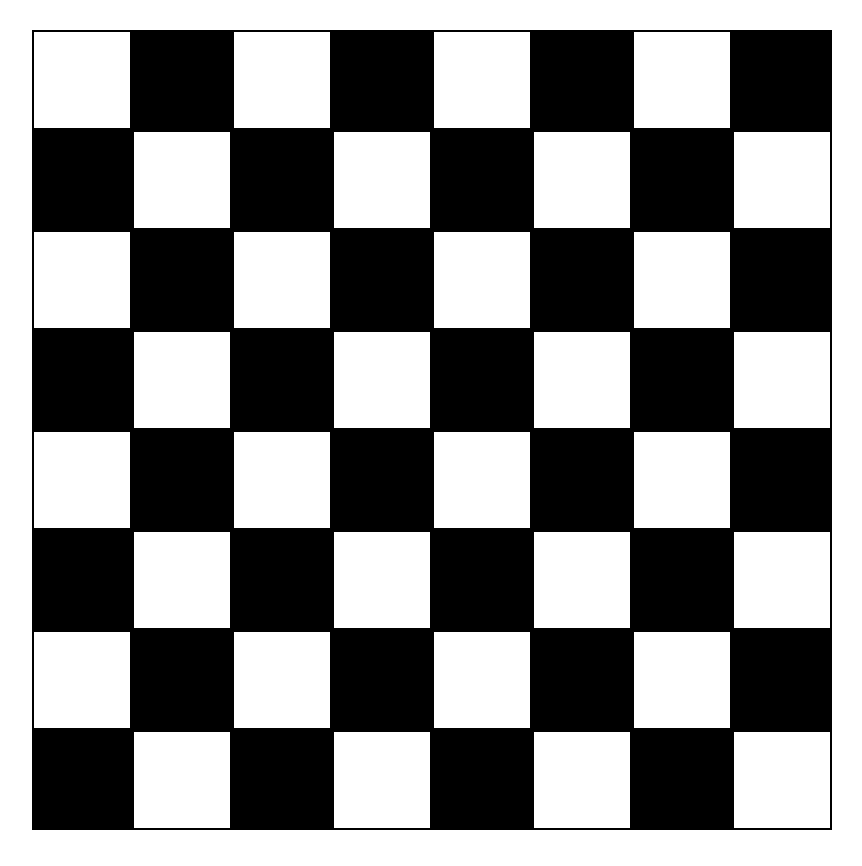

# Chessboard

Here the chessboard is made with a "for" bubble and the "if" conditional to paint the corresponding square black to create the chessboard, in the styles it is done with absolute position.

# UI design

