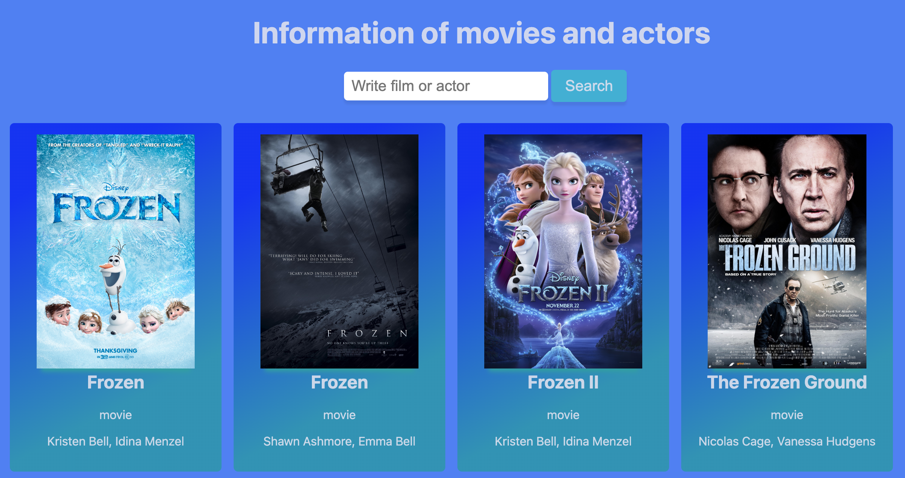
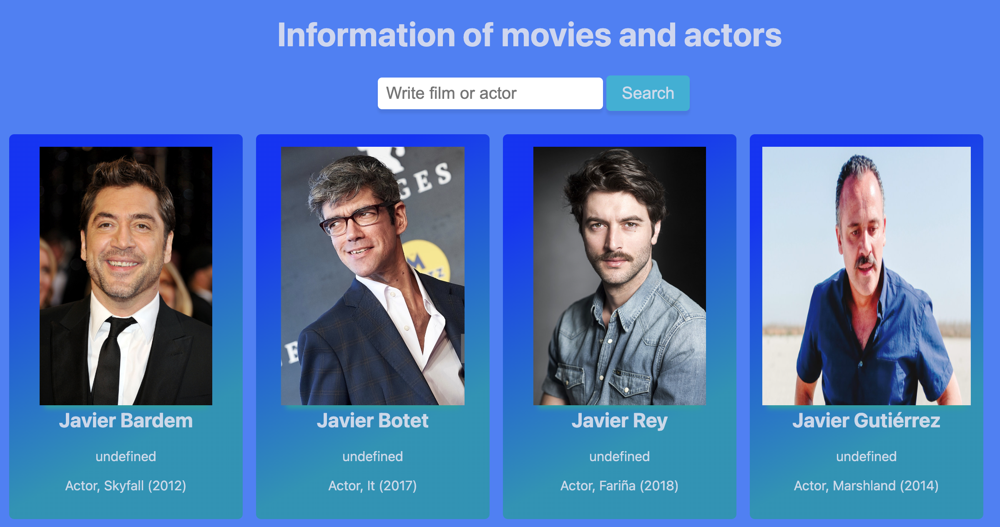

# Information Movies and Actors

Small example of using the imdb api where no framework is used.
In order to get the required keys in the request headers, rapidapi was used.
In this example the requests are made with Fetch and promises for the response.
The styles were worked with CSS and details such as hover were provided, so that when the user places the cursor over the image of the movie or actor it stands out a bit, details such as box-shadow (shadow effects) were also included to the search button and the images that the imdb database brings.

# UI design

### How to start project

Open with Live Server index.html

