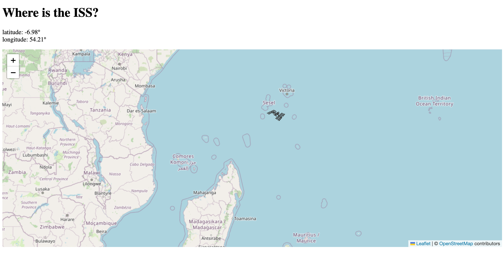

# Where is the ISS?

ISS (International Space Station) is a modular space station located in low Earth orbit that has an api that gives its location in real time, then from it and with the use of the map leafles library, it seeks to do the actual ISS location by updating the location from the satellite coordinates on the map every 1 second.

# UI design

