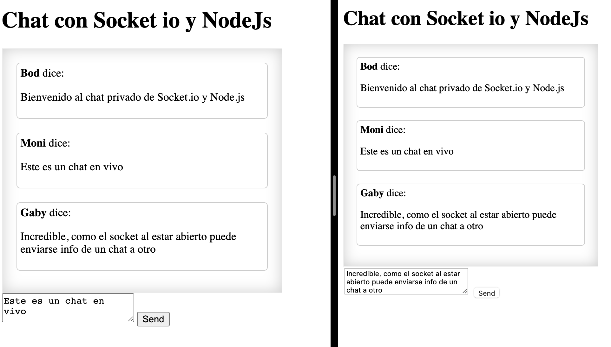

# socket io
Here is a simple example of making a chat with socket io and node, here I don't worry about the styles but about the functionality of the chat, having an open connection when writing in a chat immediately appears on the other side in whatsapp style and yes you use the ip of the computer you can make the connection with the mobile.

## Image example Chat

### How to start project

monica@Merida ~/Documents/GitHub/react-Examples/socket.io (main) $ npm start

